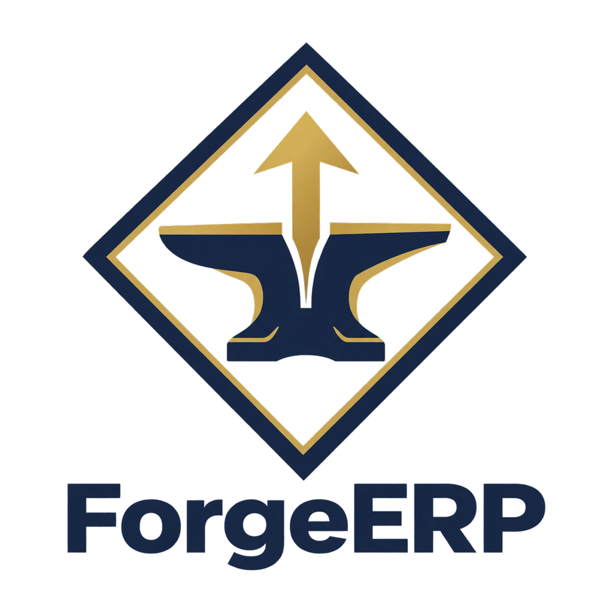
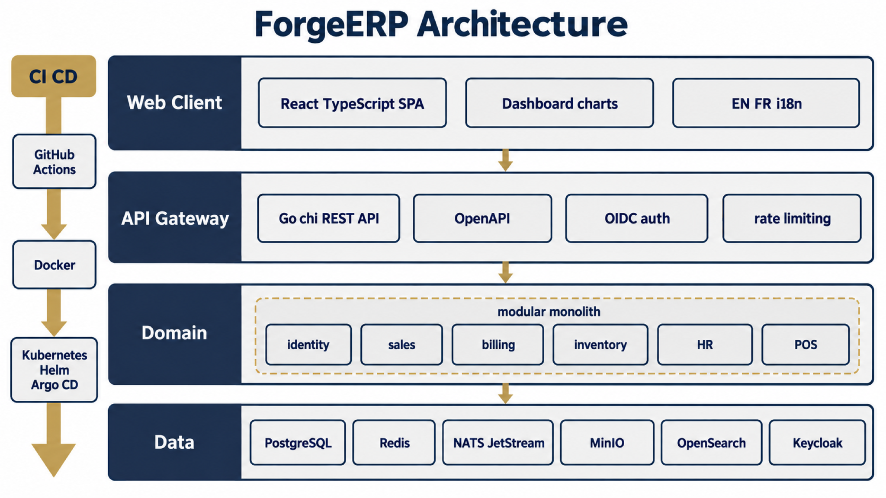

<div align="center">
  
  <h1>ForgeERP</h1>
  <p><strong>Modern open-source ERP &amp; CRM — a functional modernization of Dolibarr into a Go + React modular monolith.</strong></p>
  <p>
    <a href="https://github.com/YASSERRMD/forge-erp/actions"></a>
    
    
    
    
  </p>
</div>

Quote-to-cash, procure-to-pay, manufacturing, HR, POS, projects, and finance —
27 bounded contexts behind one versioned REST API, one React SPA (EN/FR) with a
live chart dashboard, and a stack that runs locally with a single command.

## Architecture



A **modular monolith first**: bounded contexts (`backend/internal/*`) share one
process and one PostgreSQL database, communicating over an internal event bus
(swap in NATS JetStream via `FERP_BUS_BACKEND=nats`). Object storage (MinIO/S3),
search (OpenSearch), identity (Keycloak OIDC), cache (Redis) and observability
(OTel/Prometheus/Grafana/Loki/Tempo) are behind env-selected adapters with
in-process fallbacks, so the whole system boots with just Postgres.

## Domains

| Area | Coverage |
|------|----------|
| CRM & sales | Organizations, contacts, categories · quotes → orders → shipments → invoices → payments, credit notes, POS (multi-tender, returns, walk-in) |
| Procurement | Supplier proposals/orders/receptions/invoices, approvals, contract pricing |
| Inventory & manufacturing | Warehouses, lots, stock ledger with PMP costing, BOMs, manufacturing orders |
| Finance | Double-entry ledger (hash-chained), journals, fiscal years, bank, loans, trial balance, P&L, receivables, margins, intra-EU VAT, SEPA pain.008 |
| Services | Projects/tasks/time, contracts, interventions, tickets + KB |
| People | Users/groups/RBAC, HR (leave/expenses/payroll), members, donations, recruitment |
| Platform | Documents (S3/MinIO) + bearer share links, mail (SMTP), webhooks, scheduler + reminder daemon, surveys, booking, agenda, events, assets, search, CSV import/export, FX board |

## Quickstart

```bash
docker compose up -d postgres            # or the full stack: docker compose up -d
cd backend && go test ./... && go run ./cmd/api
curl localhost:8080/healthz
```

```bash
cd frontend && npm install && npm run dev  # vite on :5173, proxies /api to :8080
```

Seed the admin on first boot:

```bash
FERP_ADMIN_EMAIL=admin@example.com FERP_ADMIN_PASSWORD='change-me-please' go run ./cmd/api
```

## Configuration

Env-first (`FERP_*`); see [docs/RUNBOOK.md](docs/RUNBOOK.md) for the full table,
including storage (`FERP_STORAGE_BACKEND`), search (`FERP_SEARCH_BACKEND`),
events (`FERP_BUS_BACKEND`, `FERP_NATS_URL`), OIDC (`FERP_OIDC_ISSUER`),
mail (`FERP_SMTP_*`), POS walk-in org, and the reminder daemon interval.

## API

The authoritative REST surface is [api/openapi.yaml](api/openapi.yaml) (~150
paths, machine-verified against the routers). Auth: dev JWT today, Keycloak
OIDC (`POST /auth/oidc` with JIT provisioning) when `FERP_OIDC_ISSUER` is set.

```bash
curl -X POST localhost:8080/api/v1/auth/login \
  -H 'Content-Type: application/json' \
  -d '{"login":"admin","password":"change-me-please"}'
```

## Layout

- `backend/cmd/api` — server entrypoint (migrations, seeds, routes, daemons)
- `backend/internal/platform` — shared kernel (config, pgx pool, migrations, bus, HTTP, metrics)
- `backend/internal/<context>` — 27 bounded contexts, each `domain → store → handler` + tests
- `backend/migrations` — versioned SQL history (`0001`–`0022`, `ferp_*` tables; proven against real PostgreSQL)
- `backend/e2e` — end-to-end chain tests
- `frontend/src` — React SPA: icon sidebar, chart dashboard, 21 pages, EN/FR
- `api/openapi.yaml` — the contract every route is checked against
- `deploy/` — compose stack, Helm chart, ArgoCD app, Keycloak realm
- `docs/` — [architecture](docs/architecture.md) · [backend pattern](docs/backend-pattern.md) · [runbook](docs/RUNBOOK.md) · [differences vs Dolibarr](docs/DIFFERENCES.md) · [migration notes](docs/migration-notes.md)

## Testing & CI

```bash
cd backend && go build ./... && go vet ./... && go test ./...
cd frontend && npm test && npx tsc --noEmit && npm run build
```

GitHub Actions runs backend, frontend and compose checks on every PR.
Contributions land through short-lived branches → PR → **full merge commit**
(no squash); `main` is always green — see `.forgeerp-temp/MASTER.md` for the
working agreements.

## License

MIT — see [LICENSE](LICENSE).

---
<div align="center"><sub>Mohamed Yasser | Solutions Architect</sub></div>
